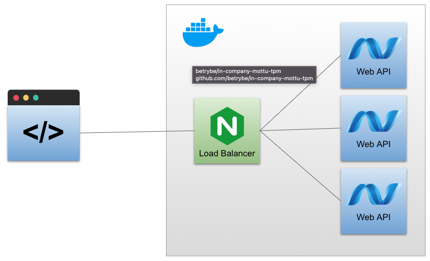
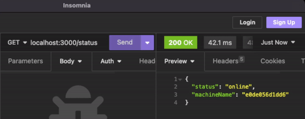

# ASP.NET Core - Load balancing com Nginx e Docker

Este projeto tem como objetivo, exemplificar o escalonamento de uma Web API construída no ASP.NET Core com o aumento do número de instâncias e como controlar o load balancing utilizando Nginx.


## Autor

- [Danilo Silva](https://www.github.com/Danilo-Oliveira-Silva)

[](https://www.linkedin.com/in/danilodevs/)
[](https://twitter.com/danilosdev)
[](mailto:danilo.o.s@hotmail.com)

## Rodando o Projeto

Clone o repositório

```shell
git clone git@github.com:Danilo-Oliveira-Silva/aspnet-load-balancing.git
```

Acesse o diretório

```shell
cd aspnet-load-balancing
```
    
Suba os containers

```shell
docker compose up -d --build
```

## Demonstração

A arquitetura dessa aplicação pode ser visualizada abaixo. Teremos uma request para o load balancer, gerenciado pelo Nginx. O mesmo irá enviar requisições em ordem para todas as replicas da API FirstAPI.



Após subir o docker compose, o mesmo irá criar 04 containers sendo 03 deles, as replicas da Web API e um para o nginx.


Será possível visualizar que cada requisição é realizada para um dos containers.



## Referência

 - [HTTP Load Balancing](https://docs.nginx.com/nginx/admin-guide/load-balancer/http-load-balancer/)
 - [Host ASP.NET Core on Linux with Nginx](https://learn.microsoft.com/en-us/aspnet/core/host-and-deploy/linux-nginx?view=aspnetcore-8.0&tabs=linux-ubuntu)


